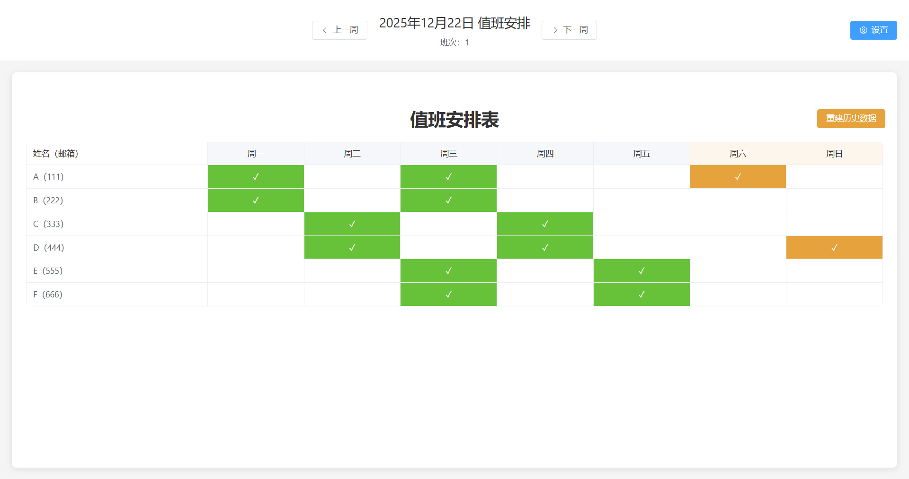
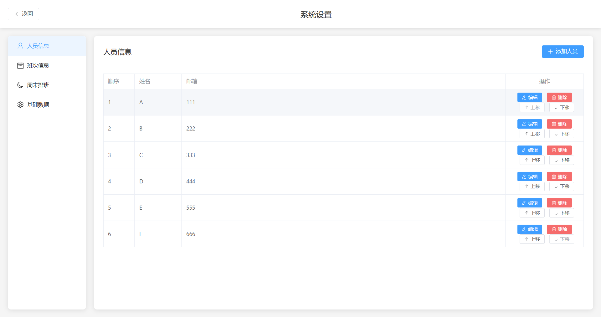
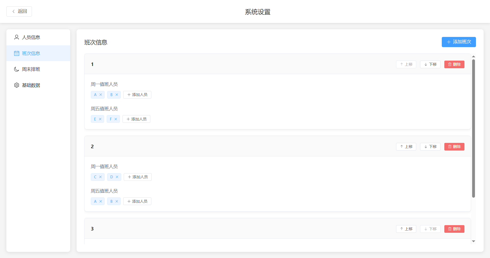
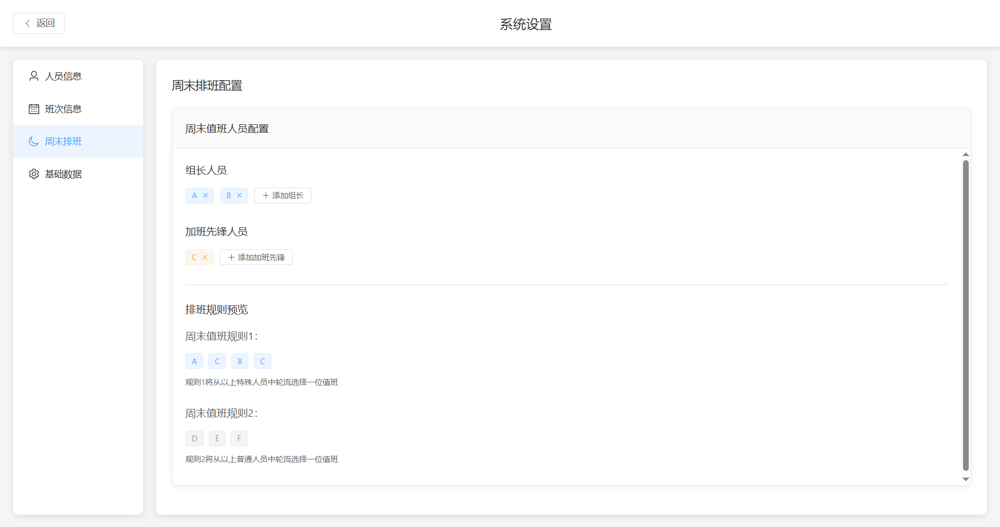
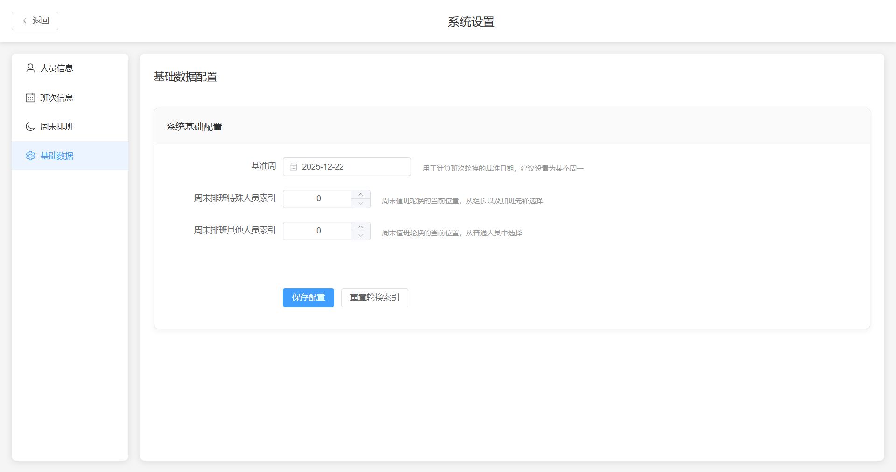

# electron-onduty(个人值班系统)

An Electron application with Vue and TypeScript



### 设置页面:


### 工作日班次配置(规则: 预先配置周一\周五值班人员, 周一与周五一起在周三值班, 其余均为周二\周四值班):


### 周末特殊值班(规则1:特殊人员抽1人,组长与加班先锋值班,但是加班先锋必须值班两次,且轮流交替; 规则2: 从其余组员轮流抽1人值班; 共计每周末两人值班)


### 基础数据配置(可配置工作日值班基准数据, 周末特殊排班基准数据, 便于随时随地开始生成需要的排班表):


## TODO

- [ ] 接入邮件系统以及Cron定时任务,每周一下午邮件发送排班表,也可直接手动触发发送排班表
- [ ] 可手动更改当前已生成的排班表
- [ ] 重建数据库增加只重建本周的功能
- [ ] 考虑假日值班情况


## Recommended IDE Setup

- [VSCode](https://code.visualstudio.com/) + [ESLint](https://marketplace.visualstudio.com/items?itemName=dbaeumer.vscode-eslint) + [Prettier](https://marketplace.visualstudio.com/items?itemName=esbenp.prettier-vscode) + [Volar](https://marketplace.visualstudio.com/items?itemName=Vue.volar)

## Project Setup

### Install

```bash
$ npm install
```

### Development

```bash
$ npm run dev
```

### Build

```bash
# For windows
$ npm run build:win

# For macOS
$ npm run build:mac

# For Linux
$ npm run build:linux
```
